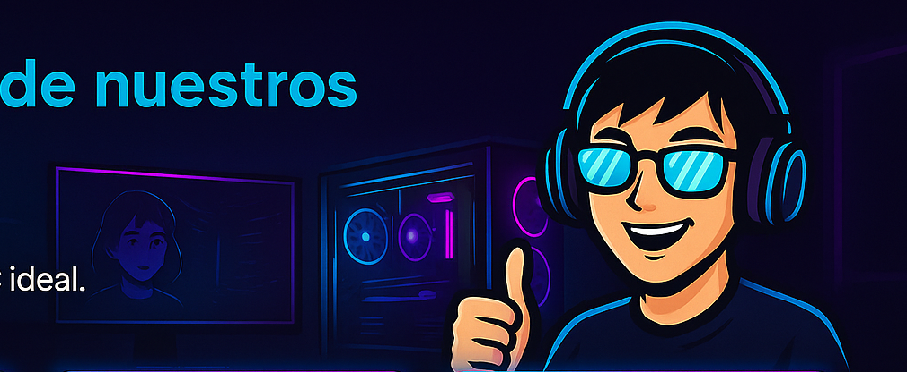

<div align="center">

# 🖥️ CHINOPC

### Armados personalizados para gaming, streaming y trabajo

[](https://lilianaruva.github.io/chinopc/)
[](https://react.dev)
[](https://www.typescriptlang.org)
[](https://vitejs.dev)

</div>

---

## ✨ ¿Qué es CHINOPC?

**CHINOPC** es una tienda de armado de computadoras personalizadas ubicada en Ciudad de Mexico. Nos especializamos en construir la PC ideal para cada persona, ya sea para jugar, hacer streaming o trabajar.

> 💡 **¿Tu objetivo es jugar a maximos graficos? ¿Transmitir en vivo? ¿Editar video?**
> En CHINOPC te asesoramos y armamos el equipo perfecto segun tu presupuesto y necesidades.

---

## 🌐 Visitanos en linea

<div align="center">

### 👉 [lilianaruva.github.io/chinopc](https://lilianaruva.github.io/chinopc/) 👈

</div>

---

## 🖼️ Capturas de pantalla

<div align="center">

### Pagina de inicio


### Galeria de builds


### Opiniones de clientes



</div>

---

## 🛠️ ¿Como funciona?

El proceso para tener tu PC ideal es muy sencillo:

| Paso | Que hacemos |
|------|-------------|
| 1️⃣ **Contacto** | Nos escribes por WhatsApp o agendas una asesoria gratuita |
| 2️⃣ **Cotizacion** | Te enviamos opciones de builds segun tu presupuesto y uso |
| 3️⃣ **Armado** | Ensamblamos tu PC con componentes de calidad y pruebas rigurosas |
| 4️⃣ **Entrega** | Recibes tu equipo listo para usar con garantia y soporte tecnico |

---

## 🎮 Tipos de builds disponibles

| Build | Componentes | Ideal para |
|-------|-------------|-----------|
| **Entry Gaming** | RTX 4060 · Ryzen 5 · 16GB RAM | Juegos casuales y esports |
| **Streaming** | RTX 4060 · Intel i5 · 16GB RAM | Streamers y creadores de contenido |
| **Gaming Pro** | RTX 4070 · Ryzen 7 · 32GB RAM | Gaming de alto rendimiento |
| **Workstation** | RTX 4080 · Ryzen 9 · 64GB RAM | Edicion de video y diseño profesional |

---

## 📬 Contacto

| Canal | Detalle |
|-------|---------|
| 📱 WhatsApp | +52 55 1234 5678 |
| 📧 Email | contacto@chinopc.com |
| 📍 Ubicacion | Ciudad de Mexico, CDMX |
| 🕐 Horario | Lunes a Sabado · 10:00 – 19:00 |

---

## 🚀 Para desarrolladores

¿Quieres correr el proyecto localmente? Sigue estos pasos:

```bash
# 1. Clona el repositorio
git clone https://github.com/lilianaruva/chinopc.git
cd chinopc

# 2. Instala dependencias
npm install

# 3. Inicia el servidor de desarrollo
npm run dev
```

El sitio estara disponible en `http://localhost:5173`

### Comandos disponibles

```bash
npm run dev      # Servidor de desarrollo con recarga en caliente
npm run build    # Compila para produccion
npm run lint     # Verifica el codigo con ESLint
npm run preview  # Previsualiza el build de produccion
```

### Stack tecnologico

- **React 19** — Interfaz de usuario
- **TypeScript 5.9** — Tipado estatico
- **Vite 6** — Servidor de desarrollo y bundler
- **CSS personalizado** — Estilos con fondo animado de neon

---

<div align="center">

© 2025 CHINOPC · Todos los derechos reservados

**[🌐 Visitar sitio](https://lilianaruva.github.io/chinopc/)**

</div>
